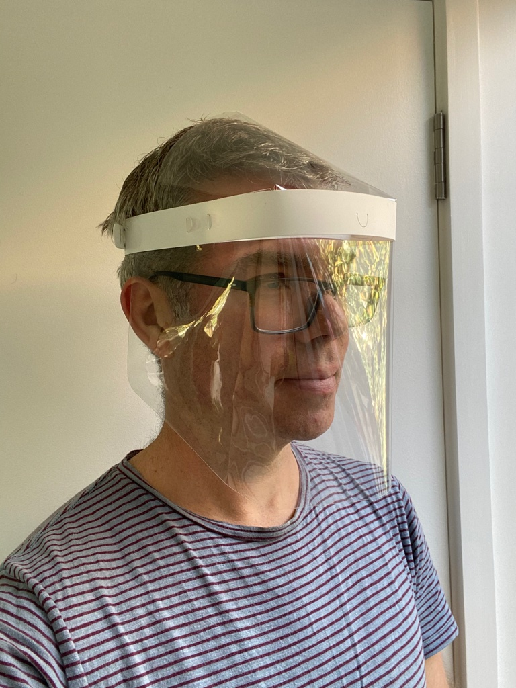

## FLEXSHIELD v1

This is a disposable and/or reusable face shield design, it's currently in the early stages of review by our local hospitals and this iteration addresses a couple of issues from our previous design.

1) Integrated shield cover now extends coverage over the front of the top of the head.

2) Fully sanitisable materials in Isopropyl alcohol - specifically no foam or adhesive parts are required that would be degraded by washing/sanitising

3) Split the design into a Full Face version that wraps over the top of the head for more protection and a standard version that simply wraps around the face and can be produced in larger quantities.

**Note that this is not an approved medical or protective device and has not been tested or certified as fit for any restricted use.**

## Source attribution
[Online Laser Cutting](onlinelasercutting.com.au)

## License
Open Source Hardware

## Sterilising protocol
Designed to withstand sterilising in 99%+ Alochol based on:
See: https://www.calpaclab.com/polypropylene-chemical-compatibility-chart/  
See: https://www.usplastic.com/knowledgebase/article.aspx?contentkey=569

## Lifespan:
Single or Multiple use.  
Should happily withstand multiple 99% Alcohol wash cycles

## Design notes:
Strap size should fit 97%+ of the population

## BOM
* 1 x Mylar faceplate
* 1 x Polypropylene head band
* 1 x Polypropylene brow strap